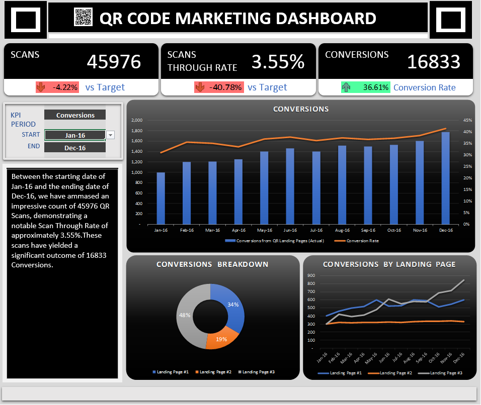

# Data Visualization - QR Coding Campaign Dashboard

The QR Coding Campaign Dashboard is a powerful tool designed to streamline and monitor your QR code-based marketing initiatives. This Excel-based dashboard provides a comprehensive overview of key metrics, allowing you to assess the performance of your campaign in real-time and make informed decisions to optimize results.

**Key Features:**

1. **Campaign Overview:**
   - Track the overall progress of your QR coding campaign.
   - View the total number of QR codes generated and distributed.

2. **QR Code Usage:**
   - Monitor the number of scans for each QR code.
   - Analyze the distribution of scans across different locations or channels.

3. **Conversion Analysis:**
   - Measure the conversion rate from QR code scans to desired actions (e.g., website visits, purchases).
   - Identify high-performing QR codes and areas for improvement.

4. **Geographical Insights:**
   - Visualize the geographic distribution of QR code scans using interactive maps.
   - Identify regions with the highest and lowest engagement.

5. **Device and Platform Analytics:**
   - Gain insights into the devices and platforms used by users to scan QR codes.
   - Optimize content and user experience based on device preferences.

6. **Time-Based Trends:**
   - Explore trends in QR code scans over time (daily, weekly, monthly).
   - Identify peak hours and days for maximum engagement.

7. **User Demographics:**
   - Collect and analyze demographic information of users who interact with QR codes.
   - Tailor future campaigns based on the target audience.

8. **Error Tracking:**
   - Monitor instances of failed scans or errors and take corrective actions.
   - Ensure a seamless user experience by addressing potential issues promptly.

9. **Campaign ROI:**
   - Calculate the return on investment for your QR coding campaign.
   - Evaluate the cost-effectiveness of various elements within the campaign.

10. **Customizable Reports:**
    - Easily generate and export customizable reports for stakeholders.
    - Share insights and performance metrics with key decision-makers.

**How to Use:**

1. **Data Input:**
   - Enter QR code details, distribution channels, and campaign parameters into the designated input sheets.

2. **Automated Calculations:**
   - The dashboard automatically calculates key metrics based on the input data.
   - Visualizations and charts are dynamically updated in real-time.

3. **Interactive Visualization:**
   - Utilize interactive charts and graphs to drill down into specific data points for deeper analysis.
   - Customize the dashboard to suit your specific reporting needs.

4. **Regular Updates:**
   - Regularly update the input data to keep the dashboard current and reflective of the latest campaign performance.

The QR Coding Campaign Dashboard is an invaluable tool for marketing professionals, providing actionable insights to enhance the effectiveness of your QR code initiatives and drive successful outcomes.
